# SOTA Agentic OS — Diagramma Architetturale

> Diagrammi Mermaid dell'architettura del sistema, inclusi i moduli Fase 1-4 (Agentic OS Evolution).

---

## 1. Architettura di Sistema (Overview)

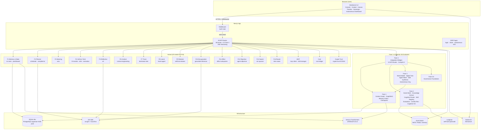
```mermaid
graph TB
    subgraph "Browser (User)"
        UI[Workbench UI<br/>Console · Cockpit · Canvas<br/>Timeline · Sovereign · Autonomous Dashboard]
    end

    subgraph "Next.js App"
        MW[Middleware<br/>Auth Gate]
        API[49 API Routes<br/>36 kernel + 13 Fase 4<br/>SSE Streaming]
        SSR[SSR Pages<br/>login · share · autonomous · 404]
    end

    subgraph "Kernel (25 moduli F1-F23)"
        F1[F1 Memory & State<br/>ns-mem · patchboard]
        F2[F2 Planner<br/>scheduler · compiled-ai]
        F3[F3 Steering<br/>acts]
        F4[F4 Verify & Taint<br/>ltl-monitor · taint · normative]
        F5[F5 Reflective<br/>erl]
        F6[F6 Context<br/>context-engineering]
        F7[F7 Trace<br/>dominator-tree]
        F8[F8 Lean4<br/>lean4-agent]
        F9[F9 Retainer<br/>artificial-retainer]
        F10[F10 Encapsulator<br/>grounded-inference]
        F11[F11 Affect<br/>affect-subsystem]
        F12[F12 Objective<br/>agent-objective]
        F13[F13 Swarm<br/>esr-quorum]
        F14[F14 Router<br/>time-router]
        MCP[MCP<br/>mcp-client · skill-manager]
        COST[Cost<br/>cost-ledger]
        CRYPTO[Crypto Trust<br/>crypto-trust ECDSA]
    end

    subgraph "Fase 1-4 (Agentic OS Evolution)"
        GOV[Fase 0.5<br/>Governance Foundation]
        CG[Fase 1<br/>Context Graph · GraphRAG<br/>Memory Fabric · Checkpoint]
        ENT[Fase 2<br/>Event Mesh · Knowledge Extract<br/>Cognitive Router · Skill Registry<br/>Evaluation · Conflict Res · Cognitive GC]
        AGI[Fase 3<br/>World Model · Digital Twin<br/>Agent Mesh · Skill Synthesis<br/>Autonomous Org]
        INT[Fase 4<br/>Integration Bridges<br/>13 API Routes · Cockpit UI]
    end

    subgraph "Infrastructure"
        DB[(SQLite dev<br/>/PostgreSQL+pgvector+AGE prod)]
        BUS[(Event Mesh<br/>NATS / Redis / memory)]
        LLM[ZAI SDK<br/>zai-glm + local-first]
        EMB[Xenova Transformers<br/>all-MiniLM-L6-v2]
        WS[Socket.IO<br/>Sensorium]
        LANG[Langfuse<br/>self-host opzionale]
    end

    UI -->|HTTPS + WebSocket| MW
    MW -->|auth check| API
    API --> F1 & F2 & F3 & F4 & F5 & F6 & F7 & F8 & F9 & F10 & F11 & F12 & F13 & F14
    API --> MCP & COST & CRYPTO
    API --> INT
    INT --> CG & ENT & AGI
    INT --> GOV
    F1 --> DB
    CG --> DB
    ENT --> BUS
    AGI --> CG
    F2 --> LLM
    F5 --> LLM
    F10 --> LLM
    F1 --> EMB
    CG --> EMB
    API --> BUS
    API --> WS
    UI --> WS
    ENT --> LANG
```

---

## 2. Flusso di Esecuzione End-to-End

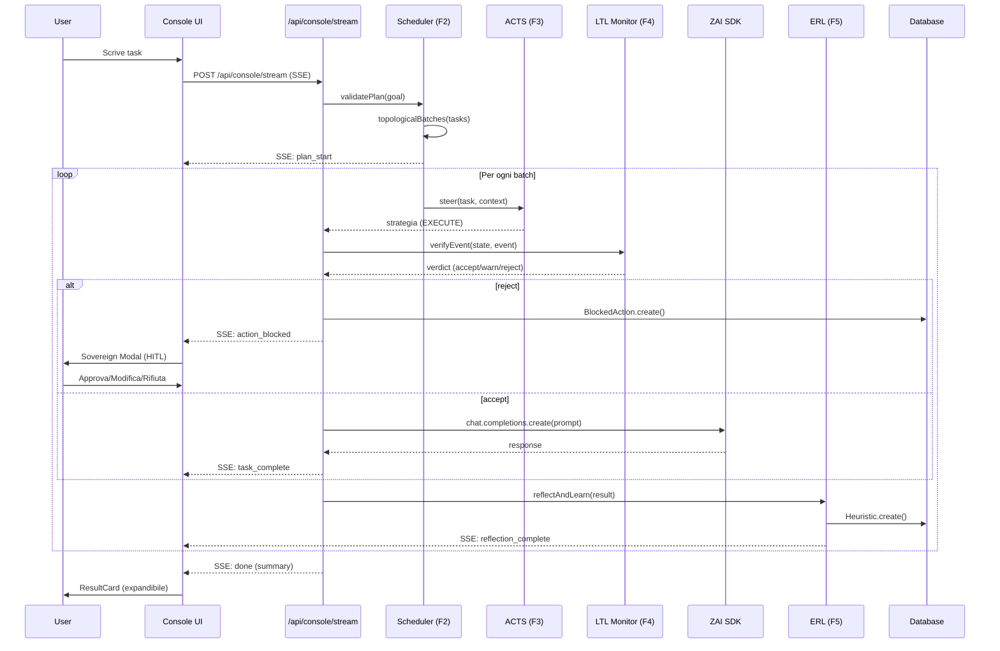
```mermaid
sequenceDiagram
    participant U as User
    participant C as Console UI
    participant API as /api/console/stream
    participant S as Scheduler (F2)
    participant A as ACTS (F3)
    participant L as LTL Monitor (F4)
    participant LLM as ZAI SDK
    participant E as ERL (F5)
    participant DB as Database

    U->>C: Scrive task
    C->>API: POST /api/console/stream (SSE)
    API->>S: validatePlan(goal)
    S->>S: topologicalBatches(tasks)
    S-->>C: SSE: plan_start

    loop Per ogni batch
        S->>A: steer(task, context)
        A-->>API: strategia (EXECUTE)
        API->>L: verifyEvent(state, event)
        L-->>API: verdict (accept/warn/reject)

        alt reject
            API->>DB: BlockedAction.create()
            API-->>C: SSE: action_blocked
            C->>U: Sovereign Modal (HITL)
            U->>C: Approva/Modifica/Rifiuta
        else accept
            API->>LLM: chat.completions.create(prompt)
            LLM-->>API: response
            API-->>C: SSE: task_complete
        end

        API->>E: reflectAndLearn(result)
        E->>DB: Heuristic.create()
        E-->>C: SSE: reflection_complete
    end

    API-->>C: SSE: done (summary)
    C->>U: ResultCard (expandibile)
```

---

## 3. Componenti UI (Struttura)

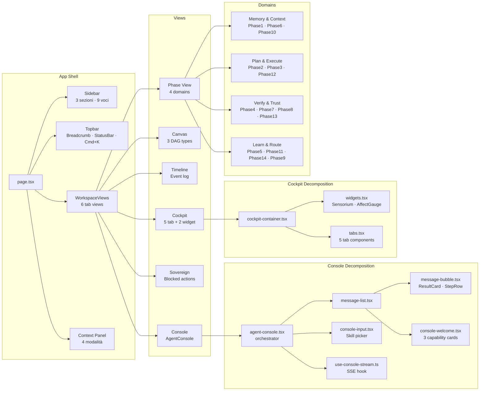
```mermaid
graph LR
    subgraph "App Shell"
        PAGE[page.tsx]
        SIDEBAR[Sidebar<br/>3 sezioni · 9 voci]
        TOPBAR[Topbar<br/>Breadcrumb · StatusBar · Cmd+K]
        WV[WorkspaceViews<br/>6 tab views]
        CP[Context Panel<br/>4 modalità]
    end

    subgraph "Views"
        CONSOLE[Console<br/>AgentConsole]
        CANVAS[Canvas<br/>3 DAG types]
        TIMELINE[Timeline<br/>Event log]
        COCKPIT[Cockpit<br/>5 tab + 2 widget]
        SOVEREIGN[Sovereign<br/>Blocked actions]
        PHASE[Phase View<br/>4 domains]
    end

    subgraph "Console Decomposition"
        AC[agent-console.tsx<br/>orchestrator]
        ML[message-list.tsx]
        MB[message-bubble.tsx<br/>ResultCard · StepRow]
        CI[console-input.tsx<br/>Skill picker]
        CW[console-welcome.tsx<br/>3 capability cards]
        UCS[use-console-stream.ts<br/>SSE hook]
    end

    subgraph "Cockpit Decomposition"
        CC[cockpit-container.tsx]
        W[widgets.tsx<br/>Sensorium · AffectGauge]
        T[tabs.tsx<br/>5 tab components]
    end

    subgraph "Domains"
        DM[Memory & Context<br/>Phase1 · Phase6 · Phase10]
        DP[Plan & Execute<br/>Phase2 · Phase3 · Phase12]
        DV[Verify & Trust<br/>Phase4 · Phase7 · Phase8 · Phase13]
        DL[Learn & Route<br/>Phase5 · Phase11 · Phase14 · Phase9]
    end

    PAGE --> SIDEBAR & TOPBAR & WV & CP
    WV --> CONSOLE & CANVAS & TIMELINE & COCKPIT & SOVEREIGN & PHASE
    CONSOLE --> AC
    AC --> ML & CI
    ML --> MB & CW
    AC --> UCS
    COCKPIT --> CC
    CC --> W & T
    PHASE --> DM & DP & DV & DL
```

---

## 4. State Management (Zustand)

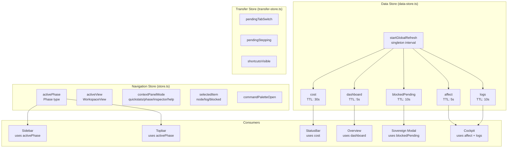
```mermaid
graph TB
    subgraph "Navigation Store (store.ts)"
        AP[activePhase<br/>Phase type]
        AV[activeView<br/>WorkspaceView]
        CPM[contextPanelMode<br/>quickstats/phase/inspector/help]
        SI[selectedItem<br/>node/log/blocked]
        CP[commandPaletteOpen]
    end

    subgraph "Data Store (data-store.ts)"
        DASH[dashboard<br/>TTL: 5s]
        BLOCK[blockedPending<br/>TTL: 10s]
        COST[cost<br/>TTL: 30s]
        AFF[affect<br/>TTL: 5s]
        LOGS[logs<br/>TTL: 10s]
        SGR[startGlobalRefresh<br/>singleton interval]
    end

    subgraph "Transfer Store (transfer-store.ts)"
        PTS[pendingTabSwitch]
        PS[pendingStepping]
        SV[shortcutsVisible]
    end

    subgraph "Consumers"
        SIDEBAR[Sidebar<br/>uses activePhase]
        TOPBAR[Topbar<br/>uses activePhase]
        STATUSBAR[StatusBar<br/>uses cost]
        OVERVIEW[Overview<br/>uses dashboard]
        SOVEREIGN[Sovereign Modal<br/>uses blockedPending]
        COCKPIT[Cockpit<br/>uses affect + logs]
    end

    AP --> SIDEBAR & TOPBAR
    COST --> STATUSBAR
    DASH --> OVERVIEW
    BLOCK --> SOVEREIGN
    AFF --> COCKPIT
    LOGS --> COCKPIT
    SGR --> DASH & BLOCK & COST & AFF & LOGS
```

---

## 5. Design System (Token Flow)

```mermaid
graph TB
    subgraph "CSS Variables (globals.css)"
        SB[--surface-base]
        SE[--surface-elevated]
        SO[--surface-overlay]
        BR[--brand oklch 0.52 0.19 245]
        CF[--cat-foundation]
        CO2[--cat-orchestration]
        CC2[--cat-cognitive]
        CT[--cat-trust]
        CL[--cat-learning]
        CG[--cat-governance]
        CI2[--cat-infrastructure]
        SO2[--status-ok]
        SW[--status-warn]
        SD[--status-danger]
        SI3[--status-info]
    end

    subgraph "Tailwind @theme inline"
        CB[color-background → surface-base]
        CC3[color-card → surface-elevated]
        CP[color-primary → brand]
        CSO[color-status-ok]
        CSW[color-status-warn]
        CSD[color-status-danger]
        CCF[color-cat-foundation]
    end

    subgraph "Tailwind Classes (native)"
        BGB[bg-background]
        BGC[bg-card]
        BGP[bg-primary]
        BGS[bg-status-ok/10]
        BGSW[bg-status-warn/10]
        TC[text-status-danger]
        TCF[text-cat-foundation]
    end

    subgraph "design-tokens.ts"
        DT[CATEGORY_COLORS<br/>STATUS_TONES<br/>SHADOW_CLASSES<br/>helpers]
    end

    SB --> CB --> BGB
    SE --> CC3 --> BGC
    BR --> CP --> BGP
    SO2 --> CSO --> BGS
    SW --> CSW --> BGSW
    SD --> CSD --> TC
    CF --> CCF --> TCF
    DT -.-> BGC & BGP & BGS & TC
```

---

## 6. Sicurezza e Auth Flow

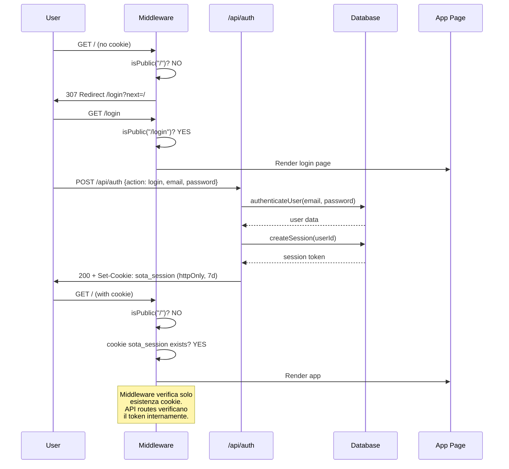
```mermaid
sequenceDiagram
    participant U as User
    participant MW as Middleware
    participant API as /api/auth
    participant DB as Database
    participant APP as App Page

    U->>MW: GET / (no cookie)
    MW->>MW: isPublic("/")? NO
    MW->>U: 307 Redirect /login?next=/

    U->>MW: GET /login
    MW->>MW: isPublic("/login")? YES
    MW->>APP: Render login page

    U->>API: POST /api/auth {action: login, email, password}
    API->>DB: authenticateUser(email, password)
    DB-->>API: user data
    API->>DB: createSession(userId)
    DB-->>API: session token
    API->>U: 200 + Set-Cookie: sota_session (httpOnly, 7d)

    U->>MW: GET / (with cookie)
    MW->>MW: isPublic("/")? NO
    MW->>MW: cookie sota_session exists? YES
    MW->>APP: Render app

    Note over MW: Middleware verifica solo<br/>esistenza cookie.<br/>API routes verificano<br/>il token internamente.
```

---

## 7. MCP Protocol Flow

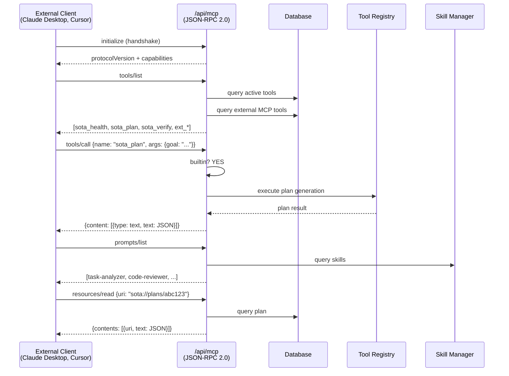
```mermaid
sequenceDiagram
    participant EXT as External Client<br/>(Claude Desktop, Cursor)
    participant MCP as /api/mcp<br/>(JSON-RPC 2.0)
    participant DB as Database
    participant TOOLS as Tool Registry
    participant SKILLS as Skill Manager

    EXT->>MCP: initialize (handshake)
    MCP-->>EXT: protocolVersion + capabilities

    EXT->>MCP: tools/list
    MCP->>DB: query active tools
    MCP->>DB: query external MCP tools
    MCP-->>EXT: [sota_health, sota_plan, sota_verify, ext_*]

    EXT->>MCP: tools/call {name: "sota_plan", args: {goal: "..."}}
    MCP->>MCP: builtin? YES
    MCP->>TOOLS: execute plan generation
    TOOLS-->>MCP: plan result
    MCP-->>EXT: {content: [{type: text, text: JSON}]}

    EXT->>MCP: prompts/list
    MCP->>SKILLS: query skills
    MCP-->>EXT: [task-analyzer, code-reviewer, ...]

    EXT->>MCP: resources/read {uri: "sota://plans/abc123"}
    MCP->>DB: query plan
    MCP-->>EXT: {contents: [{uri, text: JSON}]}
```

---

## 8. Kernel Module Dependencies

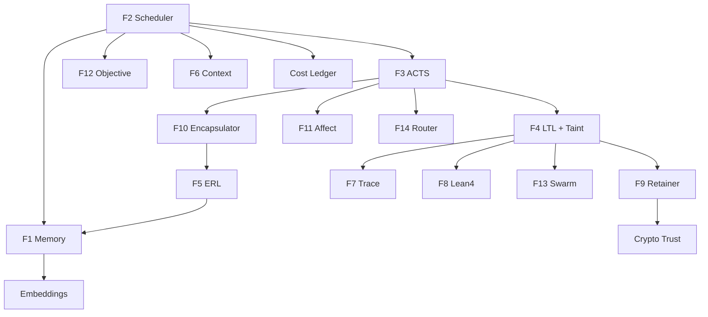
```mermaid
graph TD
    F2[F2 Scheduler] --> F1[F1 Memory]
    F2 --> F3[F3 ACTS]
    F3 --> F4[F4 LTL + Taint]
    F3 --> F10[F10 Encapsulator]
    F4 --> F9[F9 Retainer]
    F10 --> F5[F5 ERL]
    F5 --> F1
    F2 --> F12[F12 Objective]
    F2 --> F6[F6 Context]
    F3 --> F11[F11 Affect]
    F3 --> F14[F14 Router]
    F4 --> F7[F7 Trace]
    F4 --> F8[F8 Lean4]
    F4 --> F13[F13 Swarm]
    F9 --> CRYPTO[Crypto Trust]
    F2 --> COST[Cost Ledger]
    F1 --> EMB[Embeddings]
```

---

## 9. Fase 1 — Context Graph + GraphRAG + Memory Fabric

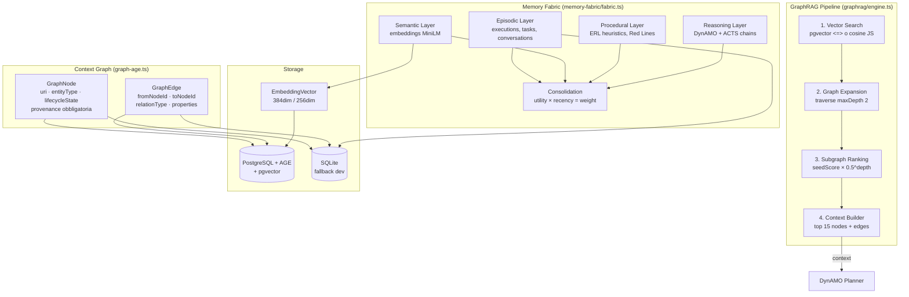
```mermaid
graph TB
    subgraph "Context Graph (graph-age.ts)"
        GN[GraphNode<br/>uri · entityType · lifecycleState<br/>provenance obbligatoria]
        GE[GraphEdge<br/>fromNodeId · toNodeId<br/>relationType · properties]
    end

    subgraph "GraphRAG Pipeline (graphrag/engine.ts)"
        VS[1. Vector Search<br/>pgvector <=> o cosine JS]
        EX[2. Graph Expansion<br/>traverse maxDepth 2]
        RK[3. Subgraph Ranking<br/>seedScore × 0.5^depth]
        BC[4. Context Builder<br/>top 15 nodes + edges]
    end

    subgraph "Memory Fabric (memory-fabric/fabric.ts)"
        EP[Episodic Layer<br/>executions, tasks, conversations]
        SE[Semantic Layer<br/>embeddings MiniLM]
        PR[Procedural Layer<br/>ERL heuristics, Red Lines]
        RE[Reasoning Layer<br/>DynAMO + ACTS chains]
        CONS[Consolidation<br/>utility × recency = weight]
    end

    subgraph "Storage"
        PG[(PostgreSQL + AGE<br/>+ pgvector)]
        SQL[(SQLite<br/>fallback dev)]
        EMB[EmbeddingVector<br/>384dim / 256dim]
    end

    VS --> EX --> RK --> BC
    BC -->|context| DYN[DynAMO Planner]

    GN --> PG
    GE --> PG
    GN --> SQL
    GE --> SQL

    EP & SE & PR & RE --> CONS
    EP --> SQL
    SE --> EMB
    EMB --> PG
```

---

## 10. Fase 2 — Event Mesh + Enterprise Modules

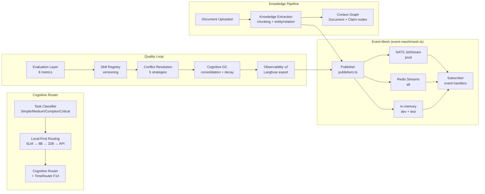
```mermaid
graph LR
    subgraph "Event Mesh (event-mesh/mesh.ts)"
        PUB[Publisher<br/>publishers.ts]
        NATS[NATS JetStream<br/>prod]
        REDIS[Redis Streams<br/>alt]
        MEM[In-memory<br/>dev + test]
        SUB[Subscriber<br/>event handlers]
    end

    subgraph "Knowledge Pipeline"
        DOC[Document Uploaded]
        EXT[Knowledge Extraction<br/>chunking + entity/relation]
        CG2[Context Graph<br/>Document + Claim nodes]
    end

    subgraph "Cognitive Router"
        TC[Task Classifier<br/>Simple/Medium/Complex/Critical]
        LF[Local-First Routing<br/>SLM → 8B → 32B → API]
        CR[Cognitive Router<br/>+ TimeRouter F14]
    end

    subgraph "Quality Loop"
        EVAL[Evaluation Layer<br/>8 metrics]
        SKL[Skill Registry<br/>versioning]
        CNT[Conflict Resolution<br/>5 strategies]
        GC[Cognitive GC<br/>consolidation + decay]
        OBS[Observability v2<br/>Langfuse export]
    end

    PUB --> NATS & REDIS & MEM
    NATS & REDIS & MEM --> SUB

    DOC --> EXT --> CG2
    EXT --> PUB

    TC --> LF --> CR

    EVAL --> SKL
    SKL --> CNT
    CNT --> GC
    GC --> OBS
    OBS --> PUB
```

---

## 11. Fase 3 — Autonomous Organization + World Model

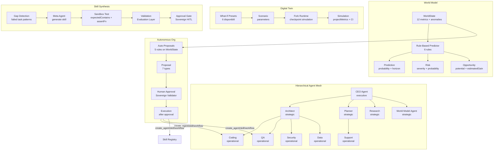
```mermaid
graph TB
    subgraph "World Model"
        WS[WorldState<br/>12 metrics + anomalies]
        PRED[Prediction<br/>probability + horizon]
        RISK[Risk<br/>severity + probability]
        OPP[Opportunity<br/>potential + estimatedGain]
        RBP[Rule-Based Predictor<br/>6 rules]
    end

    subgraph "Digital Twin"
        SC[Scenario<br/>parameters]
        FRK[Fork Runtime<br/>checkpoint simulation]
        SIM[Simulation<br/>projectMetrics + CI]
        WIF[What-If Presets<br/>6 disponibili]
    end

    subgraph "Hierarchical Agent Mesh"
        CEO[CEO Agent<br/>executive]
        ARCH[Architect<br/>strategic]
        PLAN[Planner<br/>strategic]
        RES[Research<br/>strategic]
        WM[World Model Agent<br/>strategic]
        COD[Coding<br/>operational]
        QA[QA<br/>operational]
        SEC[Security<br/>operational]
        DAT[Data<br/>operational]
        SUP[Support<br/>operational]
    end

    subgraph "Skill Synthesis"
        GAP[Gap Detection<br/>failed task patterns]
        GEN[Meta Agent<br/>generate skill]
        SBX[Sandbox Test<br/>expectedContains + assertFn]
        VAL[Validation<br/>Evaluation Layer]
        APPR[Approval Gate<br/>Sovereign HITL]
    end

    subgraph "Autonomous Org"
        PROP[Proposal<br/>7 types]
        AP[Auto-Proposals<br/>5 rules on WorldState]
        HITL[Human Approval<br/>Sovereign Validator]
        EXEC[Execution<br/>after approval]
    end

    WS --> RBP
    RBP --> PRED & RISK & OPP

    SC --> FRK --> SIM
    WIF --> SC

    CEO --> ARCH & PLAN & RES & WM
    ARCH --> COD & QA & SEC & DAT
    PLAN --> SUP

    GAP --> GEN --> SBX --> VAL --> APPR

    AP --> PROP --> HITL --> EXEC
    EXEC --> |create_agent/skill/workflow| COD & QA & SKILL_OUT[Skill Registry]

    WS --> AP
```

---

## 12. Fase 4 — Integration Layer Flow

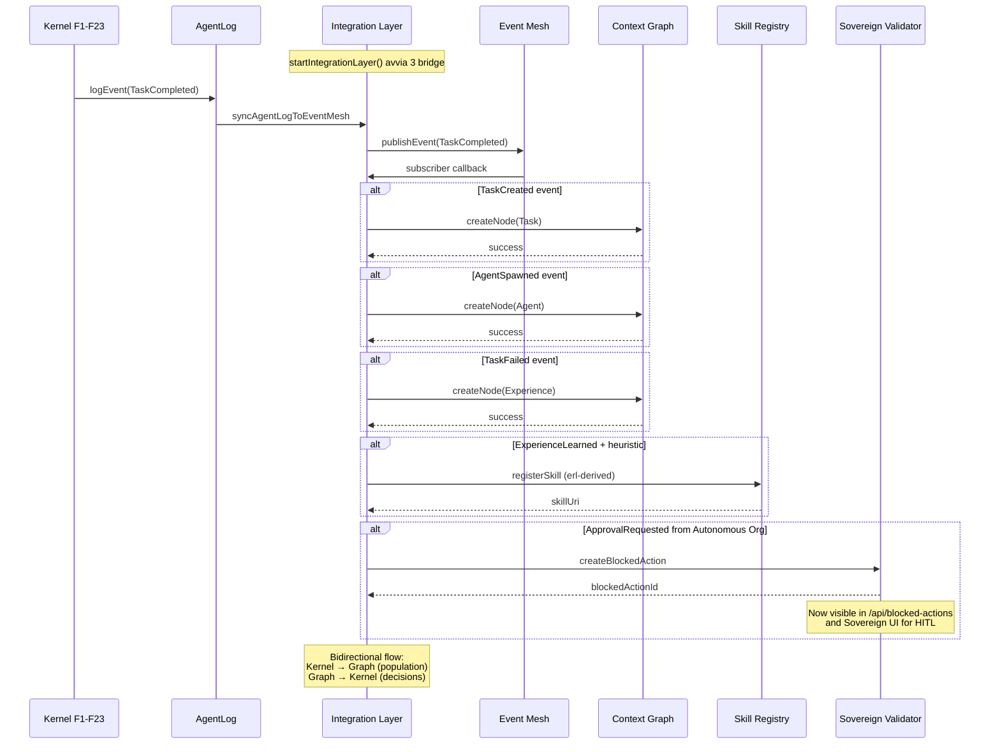
```mermaid
sequenceDiagram
    participant K as Kernel F1-F23
    participant AL as AgentLog
    participant INT as Integration Layer
    participant EM as Event Mesh
    participant CG as Context Graph
    participant SK as Skill Registry
    participant SV as Sovereign Validator

    Note over INT: startIntegrationLayer() avvia 3 bridge

    K->>AL: logEvent(TaskCompleted)
    AL->>INT: syncAgentLogToEventMesh
    INT->>EM: publishEvent(TaskCompleted)
    EM->>INT: subscriber callback

    alt TaskCreated event
        INT->>CG: createNode(Task)
        CG-->>INT: success
    end

    alt AgentSpawned event
        INT->>CG: createNode(Agent)
        CG-->>INT: success
    end

    alt TaskFailed event
        INT->>CG: createNode(Experience)
        CG-->>INT: success
    end

    alt ExperienceLearned + heuristic
        INT->>SK: registerSkill (erl-derived)
        SK-->>INT: skillUri
    end

    alt ApprovalRequested from Autonomous Org
        INT->>SV: createBlockedAction
        SV-->>INT: blockedActionId
        Note over SV: Now visible in /api/blocked-actions<br/>and Sovereign UI for HITL
    end

    Note over INT: Bidirectional flow:<br/>Kernel → Graph (population)<br/>Graph → Kernel (decisions)
```

---

## 13. Fase 1 — PostgreSQL + pgvector + AGE Stack

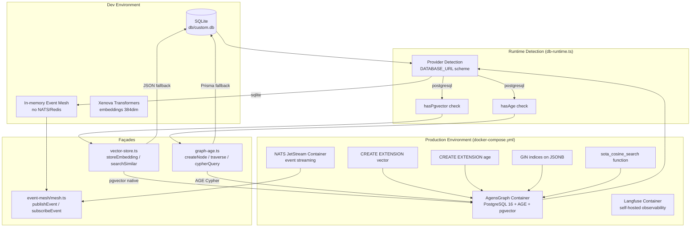
```mermaid
graph TB
    subgraph "Dev Environment"
        SQL[(SQLite<br/>db/custom.db)]
        MEM[In-memory Event Mesh<br/>no NATS/Redis]
        XEN[Xenova Transformers<br/>embeddings 384dim]
    end

    subgraph "Production Environment (docker-compose.yml)"
        AGE[AgensGraph Container<br/>PostgreSQL 16 + AGE + pgvector]
        EXT1[CREATE EXTENSION vector]
        EXT2[CREATE EXTENSION age]
        IDX[GIN indices on JSONB]
        FN[sota_cosine_search function]
        NATS2[NATS JetStream Container<br/>event streaming]
        LANG2[Langfuse Container<br/>self-hosted observability]
    end

    subgraph "Runtime Detection (db-runtime.ts)"
        PD[Provider Detection<br/>DATABASE_URL scheme]
        PGV[hasPgvector check]
        HAGE[hasAge check]
    end

    subgraph "Façades"
        VS[vector-store.ts<br/>storeEmbedding / searchSimilar]
        GA[graph-age.ts<br/>createNode / traverse / cypherQuery]
        EM2[event-mesh/mesh.ts<br/>publishEvent / subscribeEvent]
    end

    SQL --> PD
    AGE --> PD
    PD -->|postgresql| PGV
    PD -->|postgresql| HAGE
    PD -->|sqlite| MEM

    PGV --> VS
    HAGE --> GA
    NATS2 --> EM2
    MEM --> EM2

    VS -->|pgvector native| AGE
    VS -->|JSON fallback| SQL
    GA -->|AGE Cypher| AGE
    GA -->|Prisma fallback| SQL

    EXT1 --> AGE
    EXT2 --> AGE
    IDX --> AGE
    FN --> AGE
```

---

## 14. Fase 3.4 — Hierarchical Agent Mesh Topology

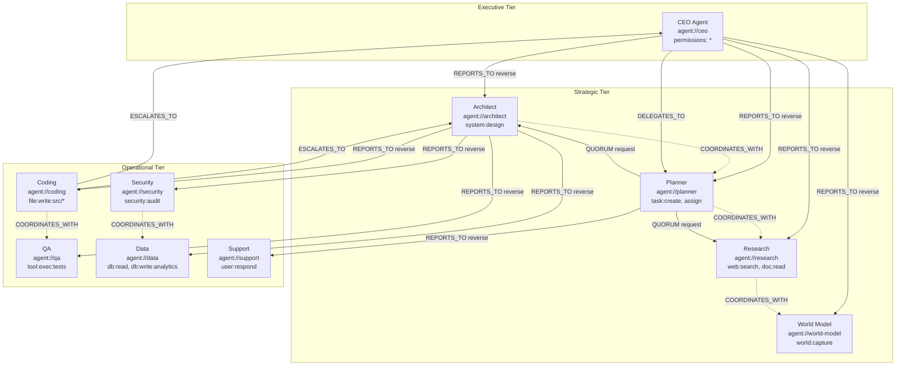
```mermaid
graph TB
    subgraph "Executive Tier"
        CEO[CEO Agent<br/>agent://ceo<br/>permissions: *]
    end

    subgraph "Strategic Tier"
        ARCH[Architect<br/>agent://architect<br/>system:design]
        PLAN[Planner<br/>agent://planner<br/>task:create, assign]
        RES[Research<br/>agent://research<br/>web:search, doc:read]
        WMA[World Model<br/>agent://world-model<br/>world:capture]
    end

    subgraph "Operational Tier"
        COD[Coding<br/>agent://coding<br/>file:write:src/*]
        QA[QA<br/>agent://qa<br/>tool:exec:tests]
        SEC[Security<br/>agent://security<br/>security:audit]
        DAT[Data<br/>agent://data<br/>db:read, db:write:analytics]
        SUP[Support<br/>agent://support<br/>user:respond]
    end

    CEO -->|REPORTS_TO reverse| ARCH & PLAN & RES & WMA
    ARCH -->|REPORTS_TO reverse| COD & QA & SEC & DAT
    PLAN -->|REPORTS_TO reverse| SUP

    ARCH -.->|COORDINATES_WITH| PLAN
    PLAN -.->|COORDINATES_WITH| RES
    RES -.->|COORDINATES_WITH| WMA
    COD -.->|COORDINATES_WITH| QA
    SEC -.->|COORDINATES_WITH| DAT

    CEO -->|DELEGATES_TO| PLAN
    COD -->|ESCALATES_TO| ARCH
    COD -->|ESCALATES_TO| CEO

    PLAN -->|QUORUM request| ARCH
    PLAN -->|QUORUM request| RES
```

---

## 15. Fase 3.6 — Autonomous Org Proposal Flow

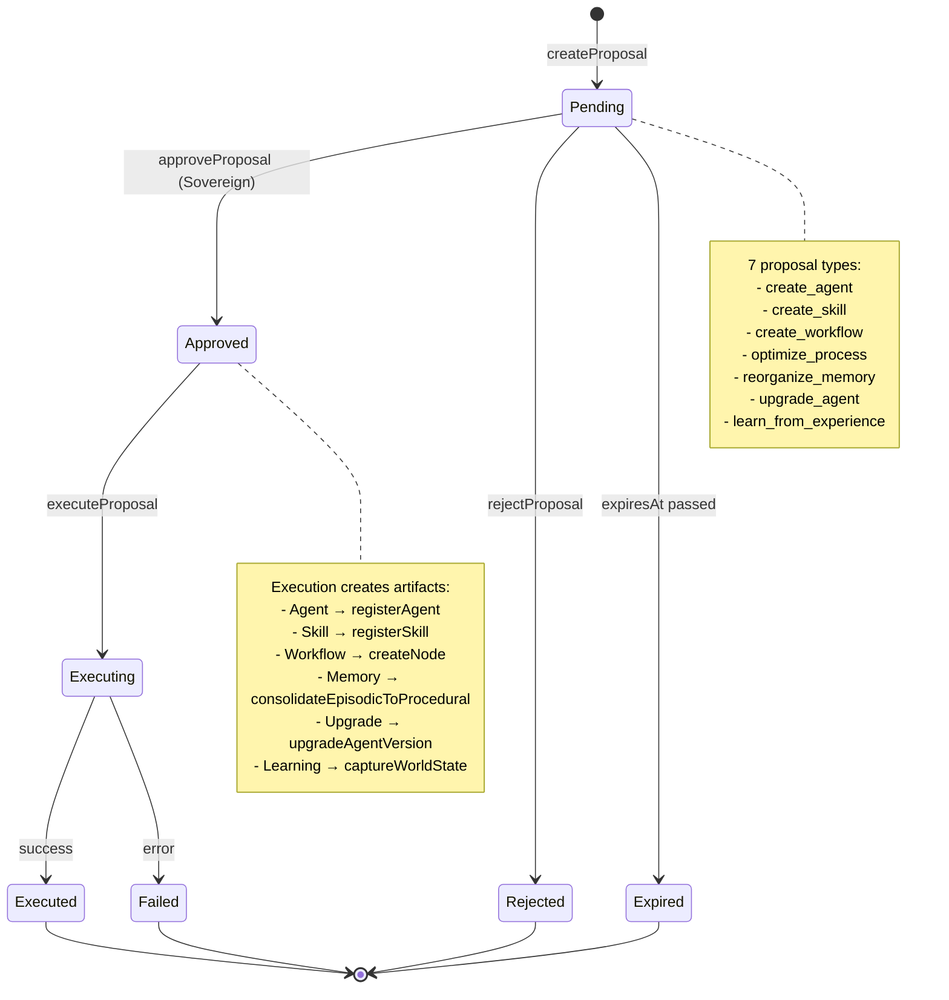
```mermaid
stateDiagram-v2
    [*] --> Pending: createProposal

    Pending --> Approved: approveProposal (Sovereign)
    Pending --> Rejected: rejectProposal
    Pending --> Expired: expiresAt passed

    Approved --> Executing: executeProposal
    Executing --> Executed: success
    Executing --> Failed: error

    Rejected --> [*]
    Expired --> [*]
    Executed --> [*]
    Failed --> [*]

    note right of Pending
        7 proposal types:
        - create_agent
        - create_skill
        - create_workflow
        - optimize_process
        - reorganize_memory
        - upgrade_agent
        - learn_from_experience
    end note

    note right of Approved
        Execution creates artifacts:
        - Agent → registerAgent
        - Skill → registerSkill
        - Workflow → createNode
        - Memory → consolidateEpisodicToProcedural
        - Upgrade → upgradeAgentVersion
        - Learning → captureWorldState
    end note
```

---

## 16. Runtime Executor — Flusso Durevole (PLAN.md WS1)

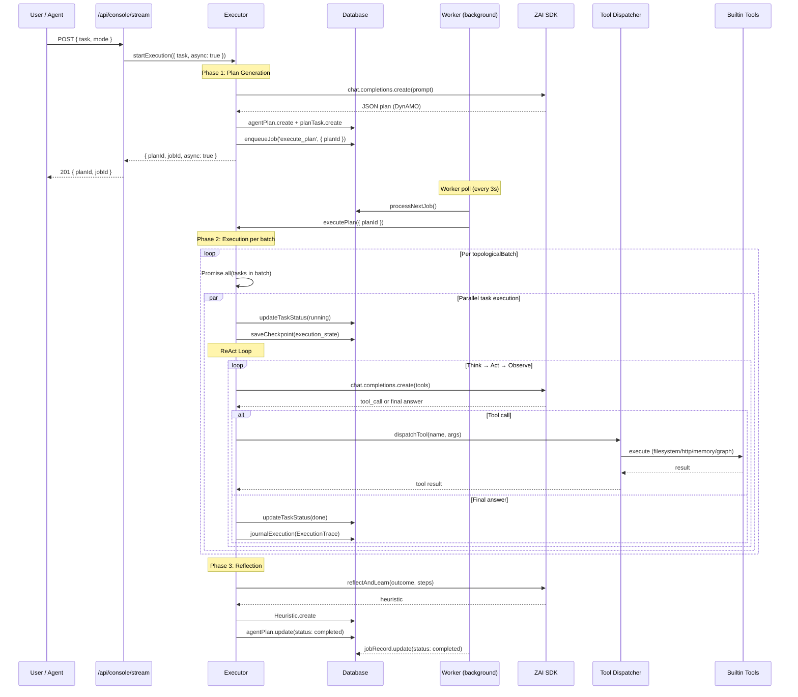
```mermaid
sequenceDiagram
    participant U as User / Agent
    participant API as /api/console/stream
    participant EX as Executor
    participant DB as Database
    participant W as Worker (background)
    participant LLM as ZAI SDK
    participant TD as Tool Dispatcher
    participant BT as Builtin Tools

    U->>API: POST { task, mode }
    API->>EX: startExecution({ task, async: true })

    Note over EX: Phase 1: Plan Generation
    EX->>LLM: chat.completions.create(prompt)
    LLM-->>EX: JSON plan (DynAMO)
    EX->>DB: agentPlan.create + planTask.create
    EX->>DB: enqueueJob('execute_plan', { planId })
    EX-->>API: { planId, jobId, async: true }
    API-->>U: 201 { planId, jobId }

    Note over W: Worker poll (every 3s)
    W->>DB: processNextJob()
    W->>EX: executePlan({ planId })

    Note over EX: Phase 2: Execution per batch
    loop Per topologicalBatch
        EX->>EX: Promise.all(tasks in batch)

        par Parallel task execution
            EX->>DB: updateTaskStatus(running)
            EX->>DB: saveCheckpoint(execution_state)

            Note over EX: ReAct Loop
            loop Think → Act → Observe
                EX->>LLM: chat.completions.create(tools)
                LLM-->>EX: tool_call or final answer
                alt Tool call
                    EX->>TD: dispatchTool(name, args)
                    TD->>BT: execute (filesystem/http/memory/graph)
                    BT-->>TD: result
                    TD-->>EX: tool result
                else Final answer
                    EX->>DB: updateTaskStatus(done)
                    EX->>DB: journalExecution(ExecutionTrace)
                end
            end
        end
    end

    Note over EX: Phase 3: Reflection
    EX->>LLM: reflectAndLearn(outcome, steps)
    LLM-->>EX: heuristic
    EX->>DB: Heuristic.create

    EX->>DB: agentPlan.update(status: completed)
    W-->>DB: jobRecord.update(status: completed)
```

---

## 17. Recovery Flow — Resume dopo Crash

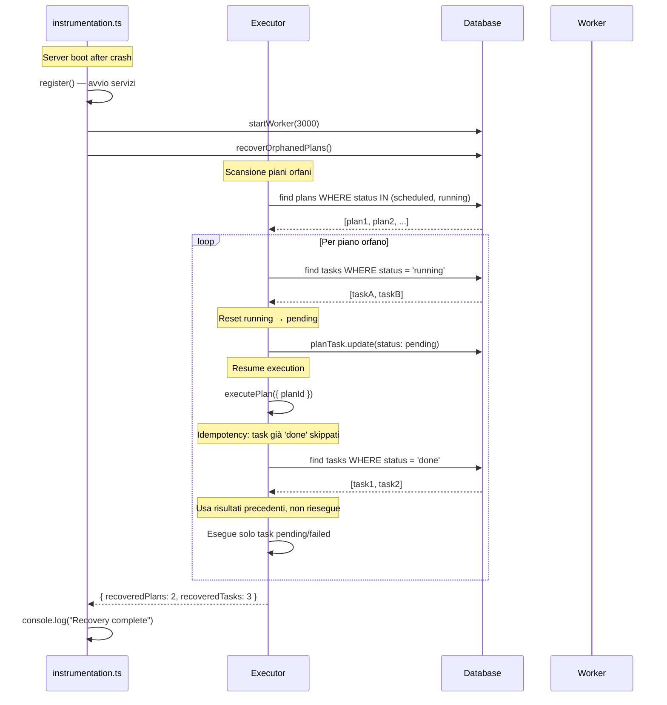
```mermaid
sequenceDiagram
    participant I as instrumentation.ts
    participant EX as Executor
    participant DB as Database
    participant W as Worker

    Note over I: Server boot after crash
    I->>I: register() — avvio servizi

    I->>DB: startWorker(3000)
    I->>DB: recoverOrphanedPlans()

    Note over EX: Scansione piani orfani
    EX->>DB: find plans WHERE status IN (scheduled, running)
    DB-->>EX: [plan1, plan2, ...]

    loop Per piano orfano
        EX->>DB: find tasks WHERE status = 'running'
        DB-->>EX: [taskA, taskB]

        Note over EX: Reset running → pending
        EX->>DB: planTask.update(status: pending)

        Note over EX: Resume execution
        EX->>EX: executePlan({ planId })

        Note over EX: Idempotency: task già 'done' skippati
        EX->>DB: find tasks WHERE status = 'done'
        DB-->>EX: [task1, task2]
        Note over EX: Usa risultati precedenti, non riesegue

        EX->>EX: Esegue solo task pending/failed
    end

    EX-->>I: { recoveredPlans: 2, recoveredTasks: 3 }
    I->>I: console.log("Recovery complete")
```

---

## 18. Interoperabilità — Protocolli Esterni (PLAN-INTEROP.md)

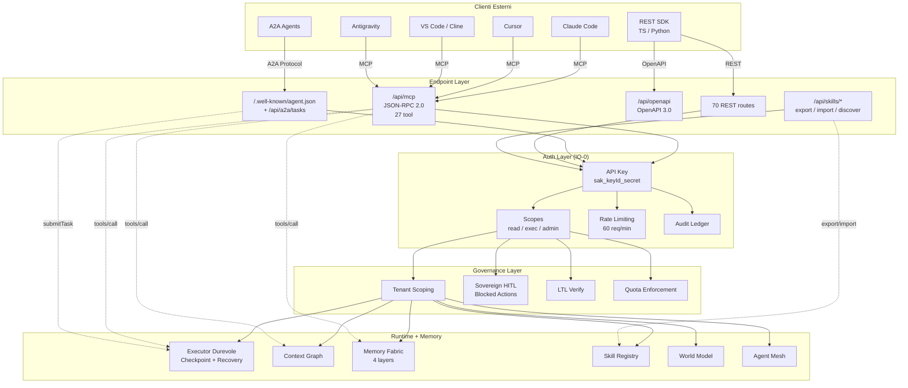
```mermaid
graph TB
    subgraph "Clienti Esterni"
        CC[Claude Code]
        CUR[Cursor]
        VS[VS Code / Cline]
        AG[Antigravity]
        A2A[A2A Agents]
        SDK[REST SDK<br/>TS / Python]
    end

    subgraph "Auth Layer (IO-0)"
        AK[API Key<br/>sak_keyId_secret]
        SC[Scopes<br/>read / exec / admin]
        RL[Rate Limiting<br/>60 req/min]
        AU[Audit Ledger]
    end

    subgraph "Endpoint Layer"
        MCP["/api/mcp<br/>JSON-RPC 2.0<br/>27 tool"]
        A2AE["/.well-known/agent.json<br/>+ /api/a2a/tasks"]
        OA["/api/openapi<br/>OpenAPI 3.0"]
        SK["/api/skills/*<br/>export / import / discover"]
        REST["70 REST routes"]
    end

    subgraph "Governance Layer"
        TEN[Tenant Scoping]
        HITL[Sovereign HITL<br/>Blocked Actions]
        LTL[LTL Verify]
        QUO[Quota Enforcement]
    end

    subgraph "Runtime + Memory"
        EXEC[Executor Durevole<br/>Checkpoint + Recovery]
        CG[Context Graph]
        MF[Memory Fabric<br/>4 layers]
        SR[Skill Registry]
        WM[World Model]
        AM[Agent Mesh]
    end

    CC -->|MCP| MCP
    CUR -->|MCP| MCP
    VS -->|MCP| MCP
    AG -->|MCP| MCP
    A2A -->|A2A Protocol| A2AE
    SDK -->|REST| REST
    SDK -->|OpenAPI| OA

    MCP --> AK
    A2AE --> AK
    REST --> AK
    SK --> AK

    AK --> SC
    AK --> RL
    AK --> AU

    SC --> TEN
    SC --> HITL
    SC --> LTL
    SC --> QUO

    TEN --> EXEC
    TEN --> CG
    TEN --> MF
    TEN --> SR
    TEN --> WM
    TEN --> AM

    MCP -.->|tools/call| EXEC
    MCP -.->|tools/call| CG
    MCP -.->|tools/call| MF
    A2AE -.->|submitTask| EXEC
    SK -.->|export/import| SR
```

---

## 19. A2A Task Lifecycle

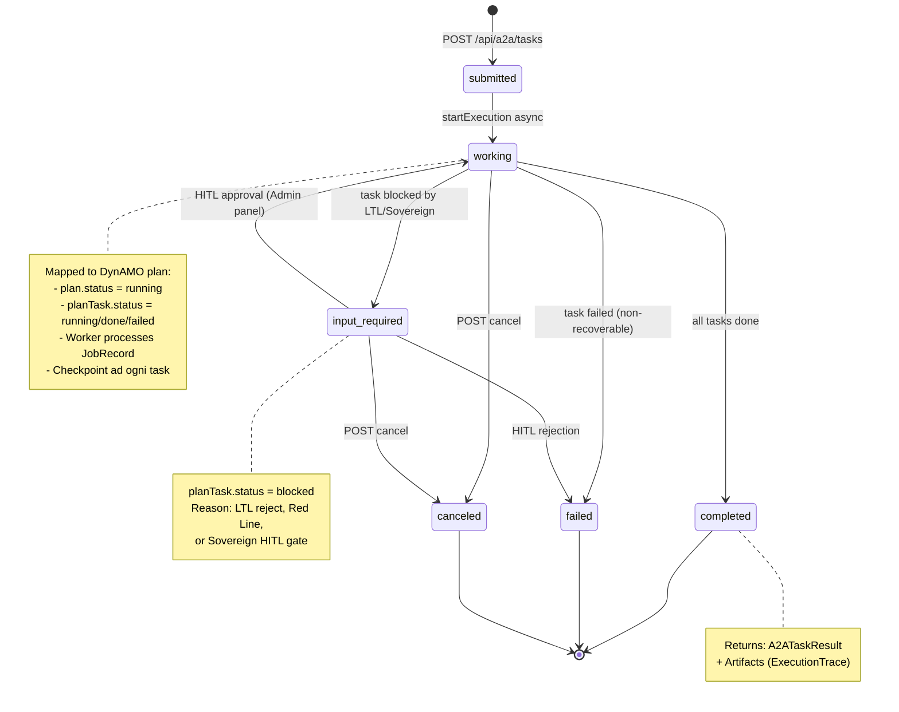
```mermaid
stateDiagram-v2
    [*] --> submitted: POST /api/a2a/tasks

    submitted --> working: startExecution async

    working --> completed: all tasks done
    working --> failed: task failed (non-recoverable)
    working --> input_required: task blocked by LTL/Sovereign
    working --> canceled: POST cancel

    input_required --> working: HITL approval (Admin panel)
    input_required --> failed: HITL rejection
    input_required --> canceled: POST cancel

    completed --> [*]
    failed --> [*]
    canceled --> [*]

    note right of working
        Mapped to DynAMO plan:
        - plan.status = running
        - planTask.status = running/done/failed
        - Worker processes JobRecord
        - Checkpoint ad ogni task
    end note

    note right of input_required
        planTask.status = blocked
        Reason: LTL reject, Red Line,
        or Sovereign HITL gate
    end note

    note right of completed
        Returns: A2ATaskResult
        + Artifacts (ExecutionTrace)
    end note
```

---

## 20. UI Information Architecture (PLAN-UIUX.md)

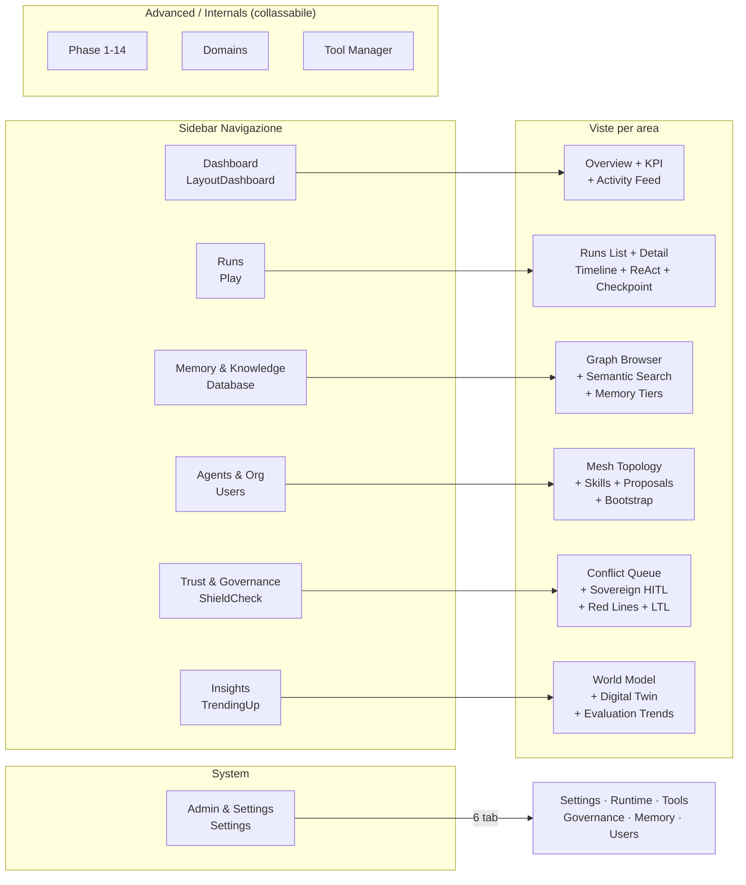
```mermaid
graph LR
    subgraph "Sidebar Navigazione"
        DASH[Dashboard<br/>LayoutDashboard]
        RUNS[Runs<br/>Play]
        MEM[Memory & Knowledge<br/>Database]
        AGT[Agents & Org<br/>Users]
        GOV[Trust & Governance<br/>ShieldCheck]
        INS[Insights<br/>TrendingUp]
    end

    subgraph "System"
        ADM[Admin & Settings<br/>Settings]
    end

    subgraph "Advanced / Internals (collassabile)"
        P1[Phase 1-14]
        DOM[Domains]
        TOOL[Tool Manager]
    end

    subgraph "Viste per area"
        OV[Overview + KPI<br/>+ Activity Feed]
        RV[Runs List + Detail<br/>Timeline + ReAct + Checkpoint]
        MKV[Graph Browser<br/>+ Semantic Search<br/>+ Memory Tiers]
        AOV[Mesh Topology<br/>+ Skills + Proposals<br/>+ Bootstrap]
        GQV[Conflict Queue<br/>+ Sovereign HITL<br/>+ Red Lines + LTL]
        IAV[World Model<br/>+ Digital Twin<br/>+ Evaluation Trends]
    end

    DASH --> OV
    RUNS --> RV
    MEM --> MKV
    AGT --> AOV
    GOV --> GQV
    INS --> IAV

    ADM -->|6 tab| ADMV[Settings · Runtime · Tools<br/>Governance · Memory · Users]
```

---

## 21. Runs View — Execution Timeline + HITL

```mermaid
graph TB
    subgraph "Runs List"
        RL1[Run 1: completed<br/>3/3 tasks done<br/>$0.027]
        RL2[Run 2: running<br/>2/4 tasks done<br/>1 blocked]
        RL3[Run 3: failed<br/>1/3 tasks done<br/>2 failed]
    end

    subgraph "Run Detail (click)"
        RD1[Stats: tasks/done/failed/cost/tokens]
        RD2[Batch 1: T1 → T2<br/>topologicalBatches]
        RD3[Batch 2: T3<br/>depends on T1+T2]
    end

    subgraph "Task Step (expandable)"
        TS1[Status icon<br/>done/failed/blocked/running]
        TS2[Agent badge + duration]
        TS3[Result (full text)]
        TS4[ReAct Loop Trace<br/>thought → tool → output]
        TS5[Metadata: started/finished/deps]
    end

    subgraph "Checkpoints"
        CP1[Checkpoint 1: execution_state<br/>task://plan/T1]
        CP2[Checkpoint 2: execution_state<br/>task://plan/T2]
        RB1[Rollback button]
    end

    subgraph "HITL (Governance)"
        BL[Blocked Action<br/>deploy to production]
        AP[Approve button]
        RJ[Reject button]
        MD[Modify button]
    end

    RL1 -->|click| RD1
    RL2 -->|click| RD1
    RD2 -->|expand| TS1
    TS1 --> TS3
    TS3 --> TS4
    RD3 --> CP1
    CP1 --> RB1
    RL2 -.->|blocked task| BL
    BL --> AP
    BL --> RJ
    BL --> MD
```

---

## 22. Auth Flow — API Key + Session (IO-0)

```mermaid
sequenceDiagram
    participant C as Client (MCP/A2A/REST)
    participant API as API Route
    participant AUTH as requireApiAuth
    participant DB as Database
    participant AUD as Audit Ledger

    C->>API: Request + Authorization: Bearer sak_...

    API->>AUTH: requireApiAuth(req, scope)

    alt API Key present
        AUTH->>AUTH: Parse sak_keyId_secret
        AUTH->>DB: apiKey.findUnique({ keyId })
        DB-->>AUTH: record (active, scopes, tenantId)
        AUTH->>AUTH: Hash compare (SHA-256)
        AUTH->>AUTH: Check scope (read/exec/admin)
        AUTH->>AUTH: checkRateLimit (sliding window)
        AUTH->>DB: update lastUsedAt (fire-and-forget)
        AUTH->>AUD: auditAccess (method, path, statusCode)
        AUTH-->>API: { ok: true, apiKey: ApiKeyInfo }
    else No API key
        AUTH->>AUTH: Fallback to session cookie
        alt Session valid
            AUTH-->>API: { ok: true, source: 'session' }
        else No auth
            AUTH-->>API: { ok: false, 401 }
        end
    end

    alt Auth OK
        API->>API: Execute route logic
        API-->>C: 200 Response + X-RateLimit headers
    else Auth failed
        API-->>C: 401 Unauthorized
    end
```

---

## 23. Multi-Tenant Isolation (IO-6)

```mermaid
graph TB
    subgraph "Tenant A"
        AKEY[API Key A<br/>sak_aaa_tenantA]
        ADATA[Plans · Tasks · Memory<br/>GraphNodes · Skills]
        AAUD[Audit Trail A]
    end

    subgraph "Tenant B"
        BKEY[API Key B<br/>sak_bbb_tenantB]
        BDATA[Plans · Tasks · Memory<br/>GraphNodes · Skills]
        BAUD[Audit Trail B]
    end

    subgraph "Enforcement"
        SCOP[Scope Check<br/>read/exec/admin]
        RATE[Rate Limit<br/>60 req/min per key]
        QUOTA[Quota Check<br/>maxRunsPerDay<br/>maxMemoryEntries<br/>maxGraphNodes]
        ISOL[Tenant Scoping<br/>tenantFilter on queries]
    end

    AKEY --> SCOP
    BKEY --> SCOP
    SCOP --> RATE
    RATE --> QUOTA
    QUOTA --> ISOL

    ISOL -->|tenantId=A| ADATA
    ISOL -->|tenantId=B| BDATA

    AKEY -.-> AAUD
    BKEY -.-> BAUD

    style AKEY fill:#e1f5fe
    style BKEY fill:#fce4ec
    style ADATA fill:#e1f5fe
    style BDATA fill:#fce4ec
```
