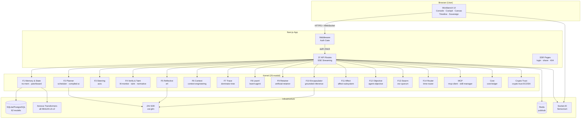
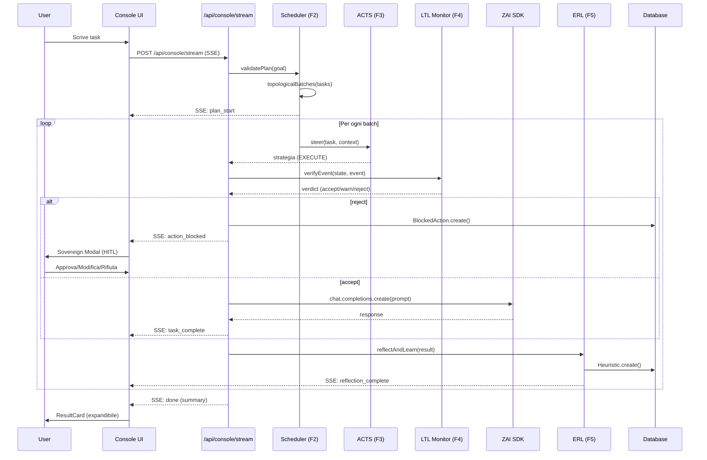
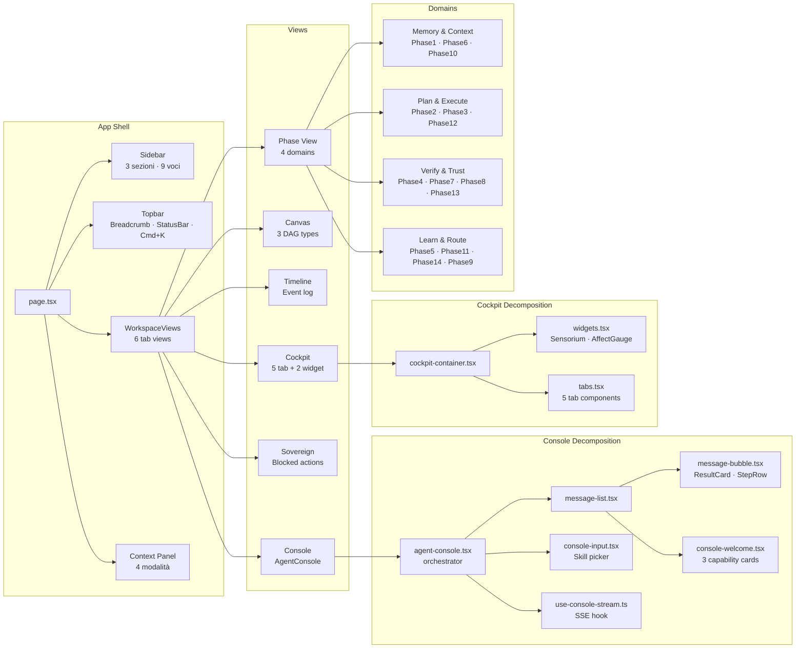
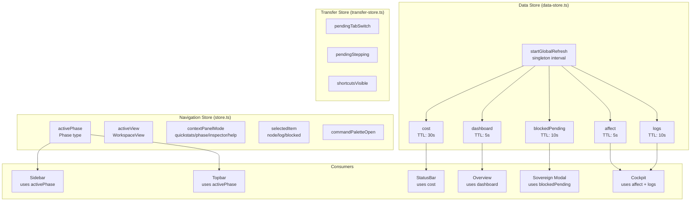
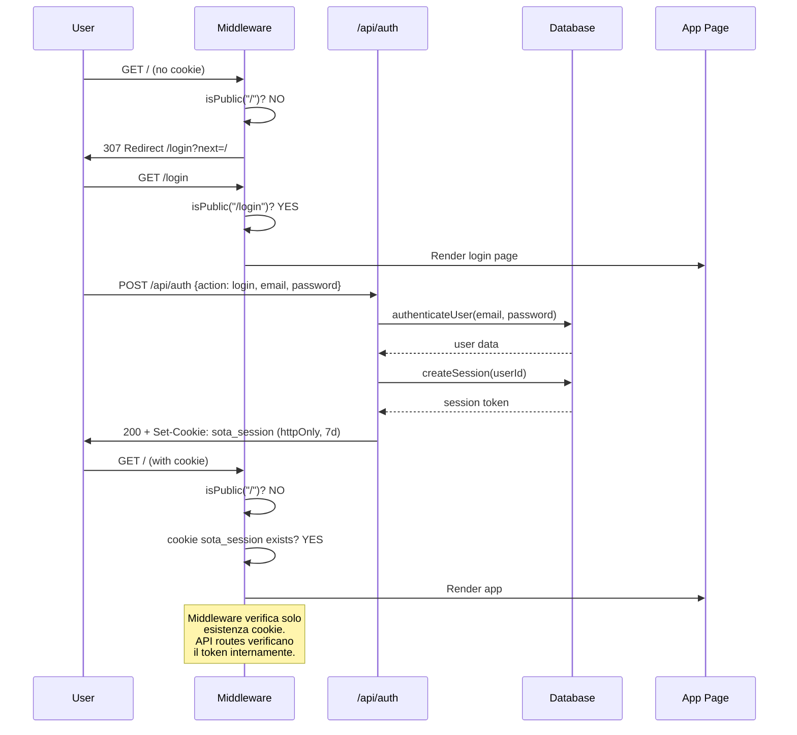
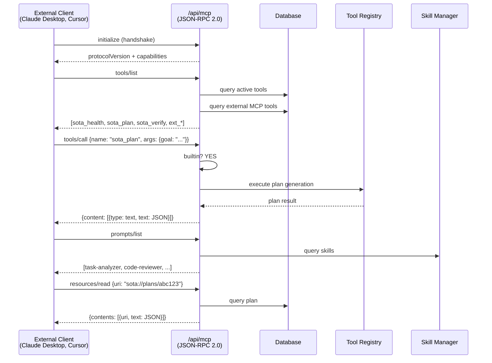
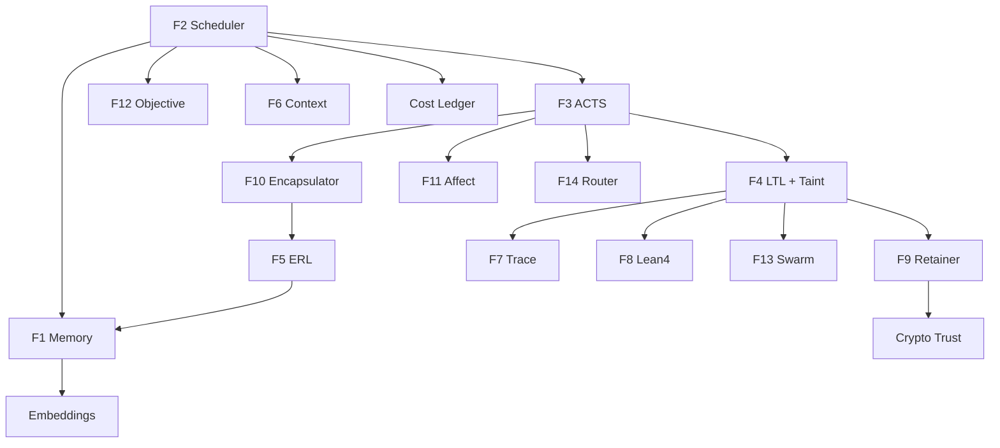

# SOTA Agentic OS — Diagramma Architetturale

> Diagrammi Mermaid dell'architettura del sistema.

---

## 1. Architettura di Sistema (Overview)

---

## 2. Flusso di Esecuzione End-to-End

---

## 3. Componenti UI (Struttura)

---

## 4. State Management (Zustand)

---

## 5. Design System (Token Flow)

```mermaid
graph TB
    subgraph "CSS Variables (globals.css)"
        SB[--surface-base]
        SE[--surface-elevated]
        SO[--surface-overlay]
        BR[--brand oklch 0.52 0.19 245]
        CF[--cat-foundation]
        CO2[--cat-orchestration]
        CC2[--cat-cognitive]
        CT[--cat-trust]
        CL[--cat-learning]
        CG[--cat-governance]
        CI2[--cat-infrastructure]
        SO2[--status-ok]
        SW[--status-warn]
        SD[--status-danger]
        SI3[--status-info]
    end

    subgraph "Tailwind @theme inline"
        CB[color-background → surface-base]
        CC3[color-card → surface-elevated]
        CP[color-primary → brand]
        CSO[color-status-ok]
        CSW[color-status-warn]
        CSD[color-status-danger]
        CCF[color-cat-foundation]
    end

    subgraph "Tailwind Classes (native)"
        BGB[bg-background]
        BGC[bg-card]
        BGP[bg-primary]
        BGS[bg-status-ok/10]
        BGSW[bg-status-warn/10]
        TC[text-status-danger]
        TCF[text-cat-foundation]
    end

    subgraph "design-tokens.ts"
        DT[CATEGORY_COLORS<br/>STATUS_TONES<br/>SHADOW_CLASSES<br/>helpers]
    end

    SB --> CB --> BGB
    SE --> CC3 --> BGC
    BR --> CP --> BGP
    SO2 --> CSO --> BGS
    SW --> CSW --> BGSW
    SD --> CSD --> TC
    CF --> CCF --> TCF
    DT -.-> BGC & BGP & BGS & TC
```

---

## 6. Sicurezza e Auth Flow

---

## 7. MCP Protocol Flow

---

## 8. Kernel Module Dependencies

